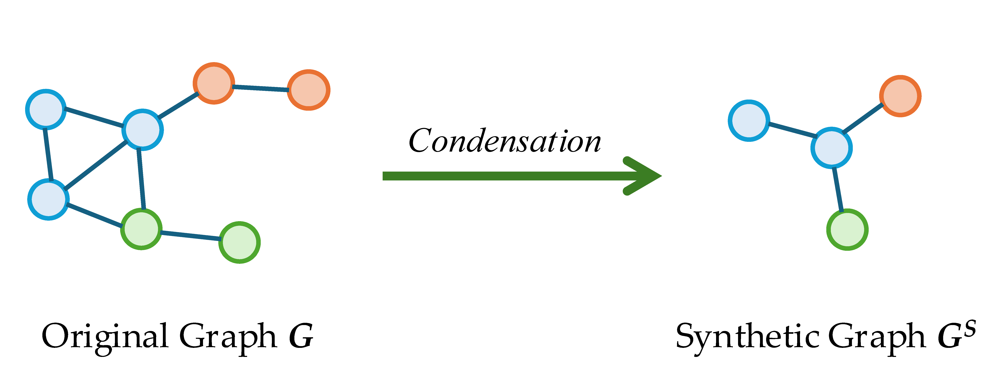

# Efficient Graph Condensation via Gaussian Process (GCGP)


## Abstract
Graph condensation reduces graph sizes while maintaining performance, addressing the scalability challenges of GNNs caused by computational inefficiencies on large datasets. Existing methods often rely on bi-level optimization, requiring extensive GNN training and limiting scalability.

This paper proposes **Graph Condensation via Gaussian Process (GCGP)**, a computationally efficient method that uses a **Gaussian Process (GP)** to estimate predictions from input nodes, eliminating the need for iterative GNN training.

GCGP incorporates a **covariance function** that aggregates local neighborhoods to capture complex node dependencies. Additionally, **Concrete random variables** approximate binary adjacency matrices in a continuous, differentiable form, enabling gradient-based optimization of discrete graph structures.


## Methodology

<div style="text-align: center;">
    <figure style="display: inline-block; text-align: center;">
        
        <figcaption style="display: block; margin-top: 10px; font-style: italic;">
            Figure 1: Graph condensation aims to condense a large graph $G$ to a smaller but informative one $G^{\mathcal{S}}$, so that it will not impact the downstream task, such as the training of the GNN models.
        </figcaption>
    </figure>
</div>

\
Existing graph condensation methods use a bi-level optimization strategy, where the condensed graph trains the GNN in the inner loop and is updated in the outer loop via a matching loss. This approach is computationally expensive due to the need for repeated GNN training.

To address this limitation, the proposed **Graph Condensation via Gaussian Process (GCGP)** method introduces a framework that integrates a **Gaussian Process (GP)** to enhance efficiency in graph condensation tasks. In this context, the condensed synthetic graph $G^{\mathcal{S}}$ represents the observations for the GP. By combining these observations with prior knowledge of the model, the GP derives the posterior distribution of the outputs, thereby circumventing the need for computationally intensive iterative training.

<div style="text-align: center;">
    <figure>
        
        <figcaption>
            Figure 2: The workflow of the proposed GCGP framework involves three key steps. First, the condensed synthetic graph $G^{\mathcal{S}}$ is utilized as the observations for the GP. Next, predictions are generated for the test locations, corresponding to the original graph $G$. Finally, the condensed graph is iteratively optimized by minimizing the discrepancy between the GP's predictions and the ground-truth labels.
        </figcaption>
    </figure>
</div>


## Implementation

### Requeirements
python=3.8.20 \
ogb=1.3.6 \
pytorch=1.12.1\
pyg=2.5.2\
numpy=1.24.3

> **Note**: It is recommended to install the $\texttt{ogb}$ package first to avoid potential misrecognition of CUDA devices.


You can also use the following command to install the environment:

```bash
conda env create -f environment.yml
```

For the datasets `Cora`, `Citeseer`, `Pubmed`, `Photo`, and `Computers`, you can run the following commands to reproduce the results:

```bash
cd gcgp
sh run.sh
python results.py
```

The `run.sh` script will execute the GCGP model on the five datasets using all the tuned parameters, and the results will be saved in the `./gcgp/outputs/` folder. The `results.py` script will then collect the final results, which will be stored in the `./gcgp/results.csv` file.

For the generalization experiment, you can run the following commands:

```bash
cd gcgp
sh run_generalization.sh
python results_generalization.py
```

The output results will be saved in the `./gcgp/outputs_generalization/` folder. The `results_generalization.py` script will collect the final results, which will be saved in the `./gcgp/results_generalization.csv` file.

For the time experiments, you can run the following command:

```bash
cd gcgp 
sh run_time.sh
```

The output results will be saved in the `./gcgp/outputs_time/` folder. You can plot the training time curve by running the following code:

```bash
cd gcgp/figures
python time_acc1.py
python time_acc2.py
```


